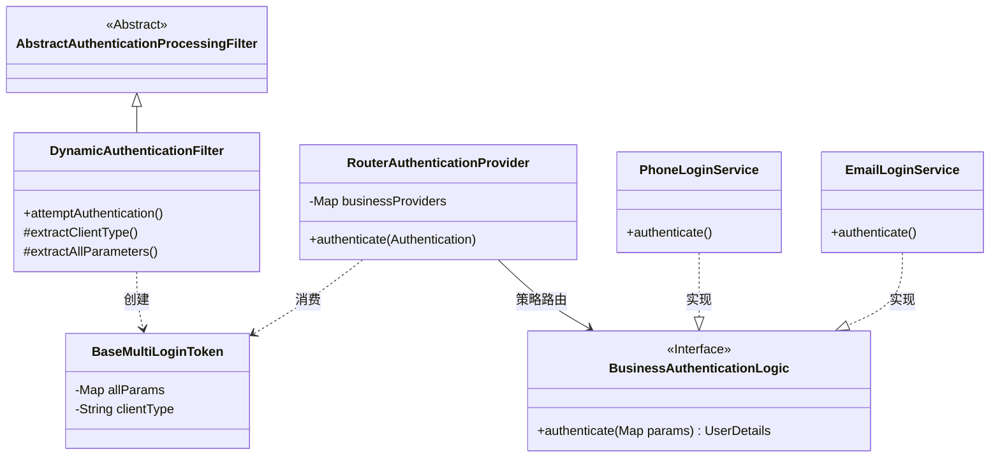
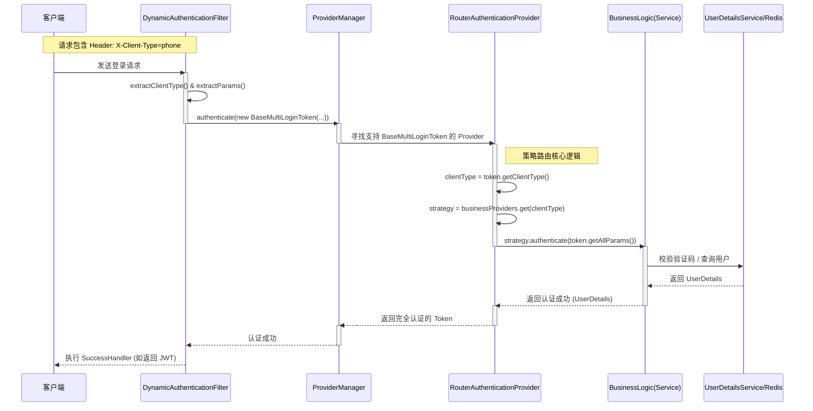

# multi-login-spring-security-starter 架构设计文档

## 1. 项目背景与核心痛点 (Background)

### 1.1 为什么开发这个 Starter？

在开发电商等复杂系统时，经常面临多端登录需求（如：C端手机验证码、B端工号密码、第三方扫码、小程序一键登录）。传统 Spring Security 的实现方式存在以下痛点：

*   **配置臃肿**：`SecurityConfig` 中充斥着大量的 `Filter` 和 `Provider` 手动注入代码，且每种登录方式都要单独配置一套。
*   **代码耦合**：每增加一种登录方式，都需要修改核心配置类，违反“开闭原则”。
*   **逻辑重复**：Token 生成、异常处理、用户信息加载等逻辑在不同登录方式中大量重复。
*   **维护困难**：业务代码与 Security 框架代码高度耦合，难以复用和拆分。

### 1.2 解决方案 (Solution)

本项目 `multi-login-spring-security-starter` 基于 Spring Boot Starter 机制，采用 **策略模式 + 模板方法模式** 重构认证流程。

*   **配置驱动**：通过 YAML 即可定义登录方式，代码量减少约 **60%**。
*   **低侵入性**：业务方只需实现特定接口（`BusinessAuthenticationLogic`），无需关心 Security 底层。
*   **即插即用**：利用 Spring 自动装配机制，引入依赖即可使用。

---

## 2. 核心架构设计 (Architecture)

### 2.1 模块划分

```text
multi-login-spring-security-parent
├── multi-login-spring-security-core        # 核心组件 (Filter, Provider, Token)
├── multi-login-spring-security-autoconfigure # 自动配置 (AutoConfiguration)
└── multi-login-spring-security-starter     # Starter 入口
```

### 2.2 核心类图 (Class Diagram)

架构的核心在于将“认证流程”与“业务逻辑”彻底解耦。



---

## 3. 详细设计与核心流程

### 3.1 认证时序图 (Sequence Diagram)

这是一次完整的登录请求处理流程，展示了请求是如何通过 Starter 被路由到具体业务逻辑的。



### 3.2 核心组件解析

#### A. DynamicAuthenticationFilter (动态过滤器)

*   **职责**：拦截登录请求，从请求中提取 `clientType`（如 "phone", "email"）和所有业务参数，封装成未认证的 `BaseMultiLoginToken`。
*   **设计模式**：**模板方法模式**。
    *   继承自 `AbstractAuthenticationProcessingFilter`。
    *   固定了“提取参数 -> 创建Token -> 提交Manager”的流程。
    *   提供了 `extractClientType` 和 `extractAllParameters` 钩子方法供子类扩展。

#### B. RouterAuthenticationProvider (路由认证提供者)

*   **职责**：作为 Security 的标准 Provider，负责将认证请求**路由**到具体的业务实现类。
*   **设计模式**：**策略模式**。
    *   内部维护一个 `Map<String, BusinessAuthenticationLogic>`。
    *   根据 Token 中的 `clientType`，动态查找对应的业务策略 Bean。
    *   **优势**：Spring Security 核心层不再依赖具体的登录逻辑，实现了完全解耦。

#### C. BusinessAuthenticationLogic (业务策略接口)

*   **职责**：业务方必须实现的接口，包含具体的校验逻辑（如比对验证码、解密密码）。
*   **扩展点**：开发者只需实现此接口并注入 Spring 容器，并在配置文件中引用 Bean 名称即可。

---

## 4. 主要设计模式应用分析

### 4.1 策略模式 (Strategy Pattern)

**应用场景**：客户端类型路由认证逻辑

**实现位置**：

1. **RouterAuthenticationProvider** 作为策略上下文
2. **BusinessAuthenticationLogic** 作为策略接口
3. **PhoneLoginService、EmailLoginService** 等作为具体策略

**代码示例**：

```java
// 策略接口
public interface BusinessAuthenticationLogic {
    Object authenticate(Map<String, String> allParams);
}

// 策略上下文
public class RouterAuthenticationProvider {
    private final Map<String, BusinessAuthenticationLogic> businessProviders;
    
    public Authentication authenticate(Authentication authentication) {
        String clientType = token.getClientType();
        BusinessAuthenticationLogic businessLogic = businessProviders.get(clientType);
        // 根据客户端类型选择策略
        Object principal = businessLogic.authenticate(token.getAllParams());
        return token;
    }
}
```

**设计优势**：

- 客户端类型与认证逻辑解耦
- 新增客户端类型只需添加新的策略实现
- 运行时动态选择认证策略

### 4.2 模板方法模式 (Template Method Pattern)

**应用场景**：标准化认证流程

**实现位置**：

1. **AbstractAuthenticationProcessingFilter** 作为模板基类
2. **DynamicAuthenticationFilter** 作为具体实现
3. **attemptAuthentication()** 作为模板方法

**流程模板**：

```
1. 提取请求参数 (extractAllParameters)
2. 识别客户端类型 (extractClientType)
3. 创建认证令牌 (BaseMultiLoginToken)
4. 委托认证管理器 (AuthenticationManager)
5. 返回认证结果
```

**代码示例**：

```java
public class DynamicAuthenticationFilter extends AbstractAuthenticationProcessingFilter {
    @Override
    public Authentication attemptAuthentication(HttpServletRequest request, HttpServletResponse response) {
        // 1. 提取参数（可重写的方法）
        Map<String, String> allParams = extractAllParameters(request);
        
        // 2. 识别客户端类型（可重写的方法）
        String clientType = extractClientType(request);
        
        // 3. 创建令牌（固定流程）
        BaseMultiLoginToken token = new BaseMultiLoginToken(...);
        
        // 4. 委托认证（固定流程）
        return this.getAuthenticationManager().authenticate(token);
    }
    
    // 可重写的钩子方法
    protected Map<String, String> extractAllParameters(HttpServletRequest request) {
        // 默认实现，可被子类重写
    }
    
    protected String extractClientType(HttpServletRequest request) {
        // 默认实现，可被子类重写
    }
}
```

**设计优势**：

- 固定认证流程，确保一致性
- 关键步骤可重写，提供扩展点
- 减少重复代码，提高可维护性

### 4.3 两种模式的协同作用

**策略模式 + 模板方法模式 = 灵活且规范的认证框架**

1. **模板方法**定义认证的标准流程
2. **策略模式**在流程的关键节点提供可替换的实现
3. **配置驱动**将策略选择外部化

> 当然也有其它设计模式，例如通过简单工厂完成Filter和Provider的创建。

## 5. 配置驱动与使用 (Usage)

得益于 Starter 的自动装配，使用方无需编写任何 Filter 或 Provider 代码。

### 5.1 YAML 配置

```yaml
multi-login:
  enabled: true
  global:
    request-client-header: X-Client-Type # 识别客户端类型的 Header Key
  methods:
    # 定义手机号登录策略
    phone:
      process-url: /login/phone
      provider-bean-name: phoneLoginService # 对应 Spring Bean 名称
      principal-param-name: mobile
      credential-param-name: code
    # 定义邮箱登录策略
    email:
      process-url: /login/email
      provider-bean-name: emailLoginService
```

### 5.2 业务实现示例

```java
@Service("phoneLoginService")
public class PhoneLoginService implements BusinessAuthenticationLogic {
    
    @Override
    public UserDetails authenticate(Map<String, String> params) {
        String mobile = params.get("mobile");
        String code = params.get("code");
        
        // 1. 校验验证码
        if (!redis.check(mobile, code)) {
            throw new BadCredentialsException("验证码错误");
        }
        
        // 2. 加载用户信息
        return userDetailsService.loadUserByUsername(mobile);
    }
}
```

